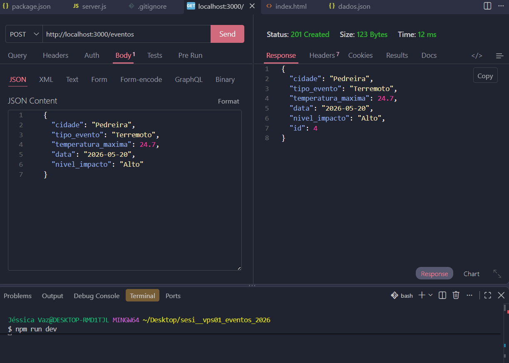
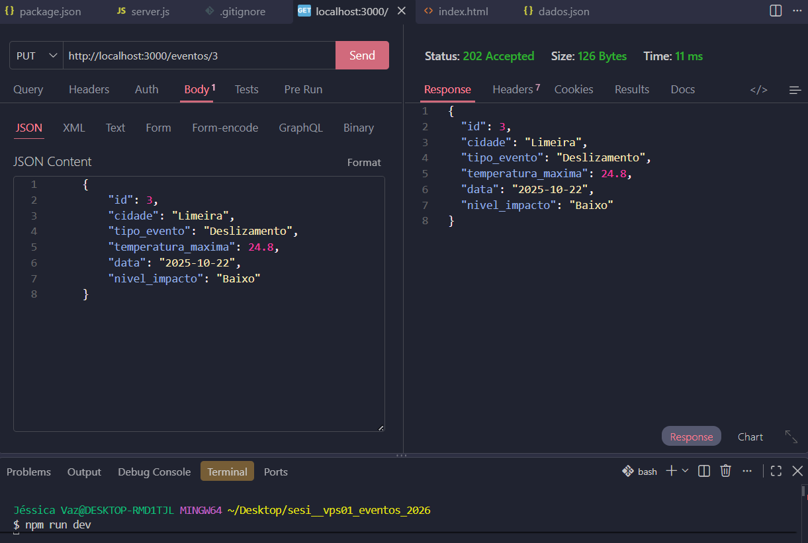
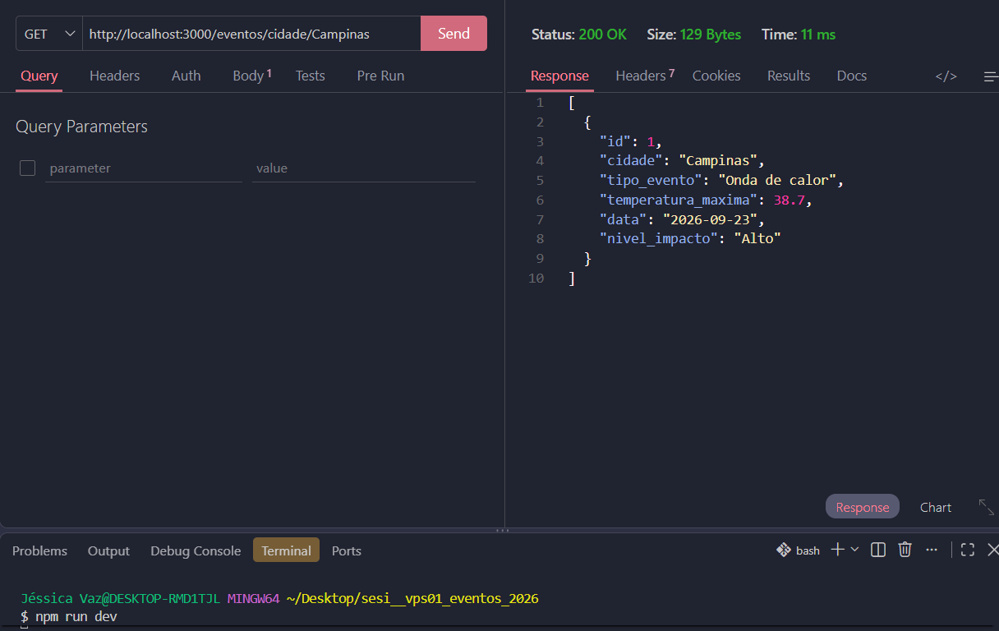
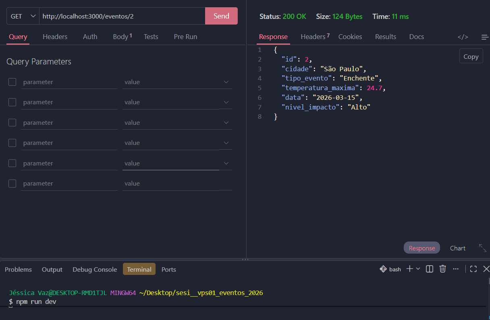
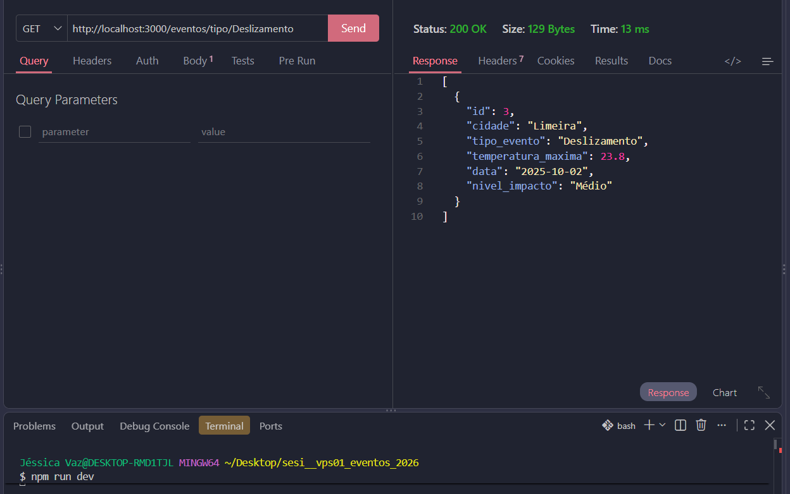
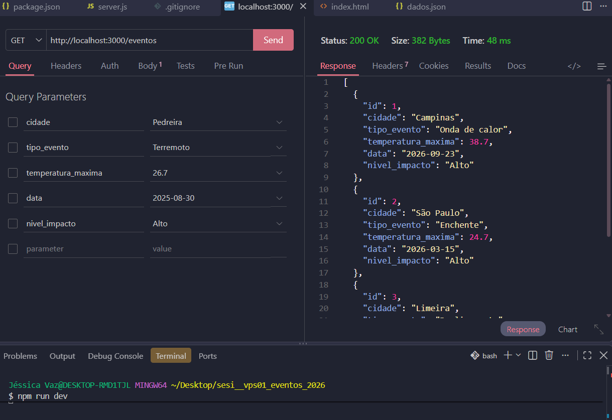
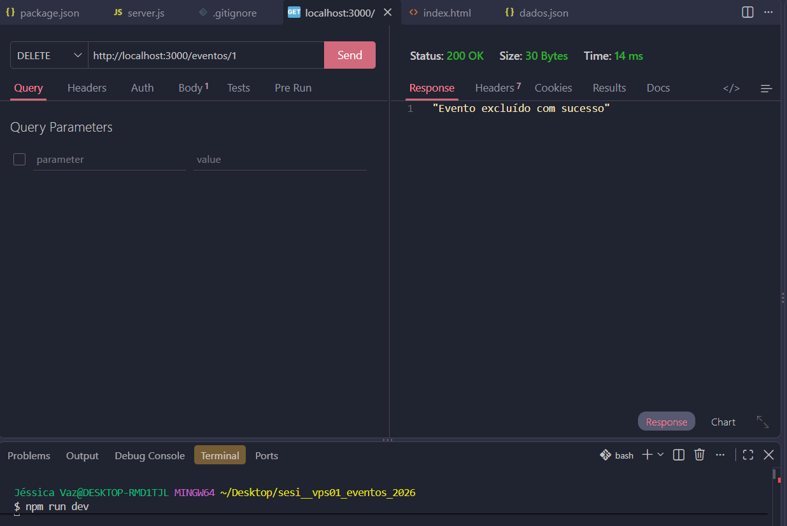
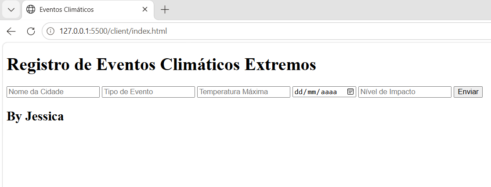
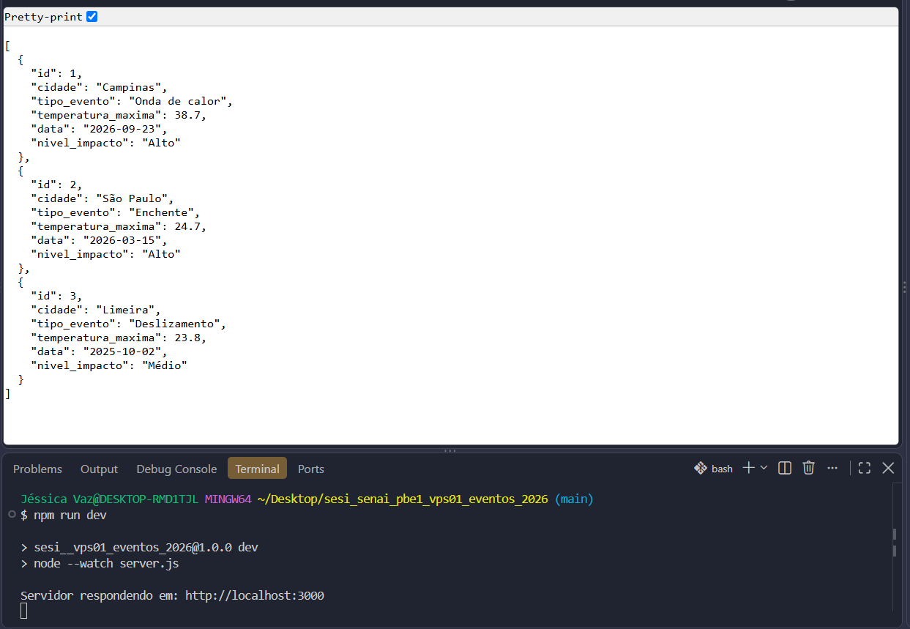

 # Registro de Eventos Climáticos Extremos

  Esta API foi desenvolvida para registrar e consultar eventos climáticos extremos, como ondas de
  calor, enchentes, secas e tempestades. O sistema permite cadastrar, buscar, atualizar e excluir eventos, utilizando um arquivo dados.json para armazenar os registros.

 ## Tecnologias utilizadas:
 - Node.js
 - JavaScript
 - VsCode
 - VsCode Thunder Client

 ## Passos para testar:
1. Clone este repositório;
2. Abra com VsCode e em um terminal digite:
```
npm install
npm run dev
```
3. Teste as rotas com a extensão Thunder Client do VsCode;
4. Abra o arquivo client/index.html com a extensão Live Server do VsCode.

## Print dos testes e exemplo de requisições:

 - CadastrarEvento



 - AtualizarEvento

 

 - BuscarCidade



 - BuscarEvento



 - BuscarTipoEvento



 - ListarEvento

 

 - ExcluirEvento



 - Tela HTML

 

 - Resposta 
 
 